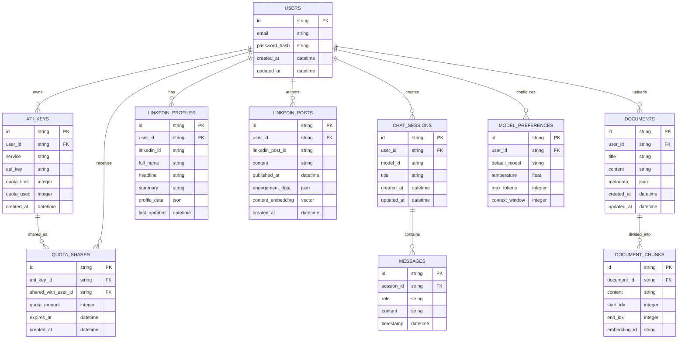

# **SuperApp System Architecture Diagrams**

This document contains the Mermaid-based diagrams for the SuperApp project, providing visual representations of the system architecture, component interactions, and data flows.

## **1. Overall System Architecture**

## **2. AI-Driven Job Preparation Assistant**

## **3. AI-Enhanced LeetCode Learning Assistant**

## **4. Local API-Based Chatbot**

## **5. AI Resume & GSoC Tracking**

## **6. Deployment Architecture**

## **7. LinkedIn Content Generation Sequence**

## **8. Chatbot with Model Switching Sequence**

## **9. RAG Query Processing Sequence**

## **10. Component Relationship Diagram**

## **11. Data Flow Diagram**

## **12. Database Schema Diagram**

