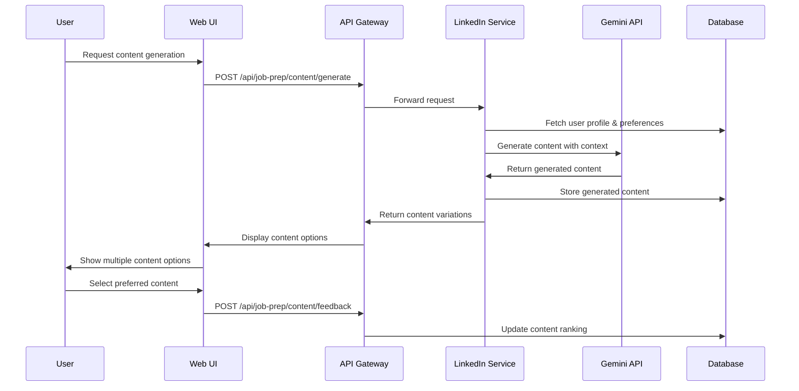
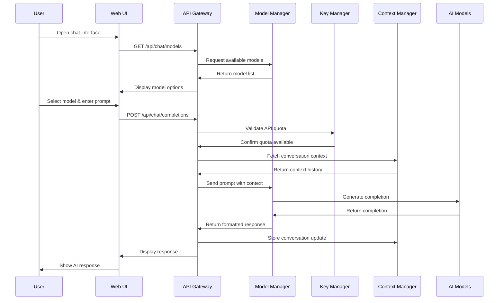
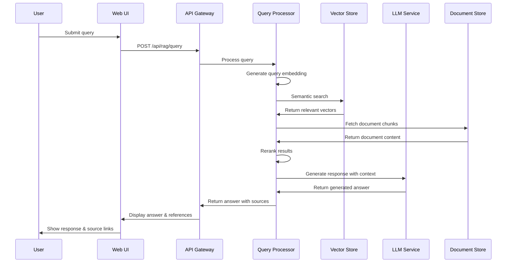

# **Low-Level Design (LLD)**

## 1. Component Specifications

### 1.1 AI-Driven Job Preparation Assistant

#### 1.1.1 LinkedIn Data Collection Module
- **Interface**: REST API with LinkedIn OAuth integration
- **Endpoints**:
  - `GET /api/linkedin/profile` - Fetch user's LinkedIn profile
  - `GET /api/linkedin/posts` - Fetch user's LinkedIn posts
  - `GET /api/linkedin/engagement` - Fetch engagement metrics
  - `POST /api/linkedin/post` - Create a new LinkedIn post
- **Data Models**:
  ```typescript
  interface LinkedInProfile {
    id: string;
    fullName: string;
    headline: string;
    summary: string;
    experience: Experience[];
    education: Education[];
    skills: Skill[];
    recommendations: Recommendation[];
  }
  
  interface LinkedInPost {
    id: string;
    content: string;
    mediaUrls?: string[];
    publishedAt: Date;
    engagement: {
      likes: number;
      comments: number;
      shares: number;
      impressions: number;
    }
  }
  ```

#### 1.1.2 Content Optimization Engine
- **Interface**: REST API with AI processing
- **Endpoints**:
  - `POST /api/content/optimize` - Optimize content for LinkedIn
  - `POST /api/content/generate` - Generate new content
  - `POST /api/content/analyze` - Analyze content performance
- **AI Integration**:
  - Uses Gemini API with prompt templates for content generation
  - Implements retry mechanism for API failures
  - Caches frequent prompts for efficiency
- **Data Flow**:
  1. Content request submitted by user
  2. NLP preprocessing to extract key topics and context
  3. Gemini API call with optimized prompts
  4. Post-processing for platform-specific formatting
  5. Return multiple content variations

#### 1.1.3 SEO & Engagement Analysis
- **Interface**: REST API for analysis
- **Endpoints**:
  - `POST /api/seo/analyze` - Analyze content for SEO optimization
  - `GET /api/engagement/trends` - Get engagement trends for similar content
- **Implementation**:
  - RAG pipeline using content embeddings
  - Uses PostgreSQL with pgvector for vector storage
  - Implements BM25 algorithm for keyword relevance

#### 1.1.4 User Feedback & Ranking
- **Interface**: REST API for user feedback
- **Endpoints**:
  - `POST /api/content/feedback` - Submit feedback on content
  - `GET /api/content/ranking` - Get ranking of content variations
- **Implementation**:
  - A/B testing framework with statistical significance
  - Uses Redis for real-time metrics tracking
  - Machine learning model to predict engagement

### 1.2 Local API-Based Chatbot

#### 1.2.1 Model Manager
- **Interface**: REST API and local SDK
- **Endpoints**:
  - `GET /api/models` - List available models
  - `POST /api/models/select` - Select model for chat
- **Implementation**:
  - Adapter pattern for different model providers
  - Lazy loading of models to reduce memory usage
  - Model switching mechanism with state preservation
  ```typescript
  interface ModelAdapter {
    initialize(): Promise<void>;
    generateResponse(prompt: string, context: string[]): Promise<string>;
    getModelInfo(): ModelInfo;
    shutdown(): Promise<void>;
  }
  
  class OllamaModelAdapter implements ModelAdapter {
    // Implementation
  }
  
  class GeminiModelAdapter implements ModelAdapter {
    // Implementation
  }
  ```

#### 1.2.2 API Key Manager
- **Interface**: REST API with secure storage
- **Endpoints**:
  - `POST /api/keys` - Add a new API key
  - `GET /api/keys/usage` - Get usage statistics
  - `PUT /api/keys/share` - Share API quota with another user
- **Security Implementation**:
  - Keys stored in encrypted format using AES-256
  - Key rotation policy implementation
  - Rate limiting per key to prevent abuse

#### 1.2.3 Context Management
- **Interface**: Internal service
- **Implementation**:
  - MongoDB for context storage
  - Sliding window context management
  - Context summarization for long conversations
  ```typescript
  interface ChatContext {
    userId: string;
    sessionId: string;
    messages: {
      role: 'user' | 'assistant';
      content: string;
      timestamp: Date;
    }[];
    summary?: string;
  }
  ```

#### 1.2.4 Web UI
- **Components**:
  - Chat interface (React component)
  - Model selector (Dropdown component)
  - Settings panel (Form component)
  - Mobile-responsive layout
- **State Management**:
  - Redux for global state
  - Local storage for session persistence
  - WebSocket for real-time updates

### 1.3 AI-Enhanced RAG Implementation

#### 1.3.1 Document Processor
- **Interface**: REST API and batch processor
- **Endpoints**:
  - `POST /api/rag/documents` - Add documents to the RAG system
  - `GET /api/rag/documents` - List indexed documents
- **Implementation**:
  - Chunking strategy with configurable size and overlap
  - Multiple embedding model support
  - Metadata extraction for improved retrieval

#### 1.3.2 Vector Store
- **Interface**: Internal service
- **Implementation**:
  - Pinecone/Qdrant/Chroma integration
  - Hybrid search (vector + keyword)
  - Namespace management for multi-tenant support
  ```python
  class VectorStore:
      def __init__(self, provider: str = "pinecone", **kwargs):
          self.provider = provider
          self.client = self._initialize_client(**kwargs)
          
      def add_documents(self, documents, embeddings, metadata=None):
          # Implementation
          
      def search(self, query_embedding, filters=None, top_k=5):
          # Implementation
  ```

#### 1.3.3 Query Processor
- **Interface**: REST API
- **Endpoints**:
  - `POST /api/rag/query` - Query the RAG system
- **Implementation**:
  - Query understanding and reformulation
  - Multi-stage retrieval pipeline
  - Reranking with cross-encoders
  - Response generation with context

## 2. Database Schema

### 2.1 User Management (PostgreSQL)
```sql
CREATE TABLE users (
  id SERIAL PRIMARY KEY,
  email VARCHAR(255) UNIQUE NOT NULL,
  password_hash VARCHAR(255) NOT NULL,
  created_at TIMESTAMP WITH TIME ZONE DEFAULT CURRENT_TIMESTAMP,
  updated_at TIMESTAMP WITH TIME ZONE DEFAULT CURRENT_TIMESTAMP
);

CREATE TABLE api_keys (
  id SERIAL PRIMARY KEY,
  user_id INTEGER REFERENCES users(id),
  service VARCHAR(50) NOT NULL,
  api_key VARCHAR(255) NOT NULL,
  quota_limit INTEGER,
  quota_used INTEGER DEFAULT 0,
  created_at TIMESTAMP WITH TIME ZONE DEFAULT CURRENT_TIMESTAMP
);

CREATE TABLE quota_shares (
  id SERIAL PRIMARY KEY,
  api_key_id INTEGER REFERENCES api_keys(id),
  shared_with_user_id INTEGER REFERENCES users(id),
  quota_amount INTEGER NOT NULL,
  expires_at TIMESTAMP WITH TIME ZONE,
  created_at TIMESTAMP WITH TIME ZONE DEFAULT CURRENT_TIMESTAMP
);
```

### 2.2 Chat Storage (MongoDB)
```javascript
// Chat Sessions Collection
{
  _id: ObjectId,
  userId: ObjectId,
  modelId: String,
  title: String,
  createdAt: Date,
  updatedAt: Date,
  messages: [
    {
      role: String,
      content: String,
      timestamp: Date
    }
  ],
  metadata: {
    tokenCount: Number,
    modelVersion: String
  }
}

// Model Preferences Collection
{
  _id: ObjectId,
  userId: ObjectId,
  defaultModel: String,
  temperature: Number,
  maxTokens: Number,
  contextWindow: Number
}
```

### 2.3 LinkedIn Content (PostgreSQL + pgvector)
```sql
CREATE TABLE linkedin_profiles (
  id SERIAL PRIMARY KEY,
  user_id INTEGER REFERENCES users(id),
  linkedin_id VARCHAR(100),
  full_name VARCHAR(255),
  headline TEXT,
  summary TEXT,
  profile_data JSONB,
  last_updated TIMESTAMP WITH TIME ZONE
);

CREATE TABLE linkedin_posts (
  id SERIAL PRIMARY KEY,
  user_id INTEGER REFERENCES users(id),
  linkedin_post_id VARCHAR(100),
  content TEXT,
  published_at TIMESTAMP WITH TIME ZONE,
  engagement_data JSONB,
  content_embedding vector(1536),
  created_at TIMESTAMP WITH TIME ZONE DEFAULT CURRENT_TIMESTAMP
);

CREATE INDEX linkedin_posts_embedding_idx ON linkedin_posts 
USING ivfflat (content_embedding vector_cosine_ops)
WITH (lists = 100);
```

### 2.4 RAG System (Chroma/Pinecone + MongoDB)
- **Chroma/Pinecone**: Vector storage for embeddings
- **MongoDB**: Metadata and document storage
```javascript
// Documents Collection
{
  _id: ObjectId,
  title: String,
  content: String,
  metadata: {
    source: String,
    author: String,
    createdAt: Date,
    tags: [String]
  },
  chunks: [
    {
      id: String, // Reference to vector DB
      content: String,
      start_idx: Number,
      end_idx: Number
    }
  ],
  userId: ObjectId,
  createdAt: Date,
  updatedAt: Date
}
```

## 3. API Specifications

### 3.1 Authentication API
- **Base URL**: `/api/auth`
- **Endpoints**:
  - `POST /register` - Register a new user
  - `POST /login` - Login and receive JWT
  - `POST /refresh` - Refresh JWT token
  - `POST /logout` - Logout user
- **Authentication Flow**:
  1. User registers/logs in and receives JWT
  2. JWT used in Authorization header for protected routes
  3. Token refresh mechanism for extended sessions

### 3.2 Job Preparation API
- **Base URL**: `/api/job-prep`
- **Authentication**: JWT required
- **Endpoints**:
  - `GET /linkedin/profile` - Get LinkedIn profile
  - `POST /linkedin/optimize-profile` - Get optimization suggestions
  - `POST /content/generate` - Generate content for LinkedIn
  - `GET /content/analytics` - Get content performance analytics

### 3.3 Chatbot API
- **Base URL**: `/api/chat`
- **Authentication**: JWT required
- **Endpoints**:
  - `GET /models` - List available models
  - `POST /completions` - Get completion from selected model
  - `GET /sessions` - List chat sessions
  - `GET /sessions/:id` - Get chat session by ID
  - `POST /sessions` - Create new chat session
  - `PUT /sessions/:id/messages` - Add message to session

### 3.4 RAG API
- **Base URL**: `/api/rag`
- **Authentication**: JWT required
- **Endpoints**:
  - `POST /documents` - Upload documents
  - `GET /documents` - List documents
  - `DELETE /documents/:id` - Delete document
  - `POST /query` - Query the RAG system
  - `POST /batch-index` - Batch index documents

## 4. Sequence Diagrams

### 4.1 LinkedIn Content Generation



### 4.2 Chatbot with Model Switching



### 4.3 RAG Query Processing



## 5. Deployment Architecture

### 5.1 Local Development Environment
- **Docker Compose** based setup with the following services:
  - Frontend (Next.js)
  - API Gateway (Express.js)
  - Microservices (Node.js & Python)
  - MongoDB
  - PostgreSQL
  - Redis
  - Vector Database (local mode)
  - Ollama (for local AI)

### 5.2 Production Deployment
- **Kubernetes** based deployment with:
  - Horizontal Pod Autoscaling
  - Ingress Controller with SSL termination
  - Persistent Volume Claims for databases
  - Secret management for API keys
  - Cloud-managed databases (optional)
  - CDN for static assets

### 5.3 CI/CD Pipeline
- **GitHub Actions** workflow:
  1. Code linting and static analysis
  2. Unit tests execution
  3. Integration tests execution
  4. Docker image building
  5. Security scanning
  6. Deployment to staging
  7. End-to-end tests
  8. Deployment to production

## 6. Testing Strategy

### 6.1 Unit Testing
- **Frontend**: Jest + React Testing Library
- **Backend**: Jest for Node.js, pytest for Python
- **Coverage target**: 80% minimum

### 6.2 Integration Testing
- API endpoint testing with supertest/pytest-httpx
- Database integration tests with test containers
- Mock external APIs for deterministic testing

### 6.3 End-to-End Testing
- Cypress for frontend workflow testing
- Performance testing with k6
- Security testing with OWASP ZAP

## 7. Security Implementation

### 7.1 API Key Management
- Encryption at rest using AES-256
- Partial key display in UI
- Audit logging for key usage
- Automated key rotation capability

### 7.2 User Authentication
- Argon2id for password hashing
- JWT with short expiration + refresh token
- CSRF protection for web endpoints
- Rate limiting for auth endpoints

### 7.3 Data Protection
- TLS 1.3 for all communications
- Database encryption for sensitive fields
- Personal data anonymization options
- Automated compliance scanning 