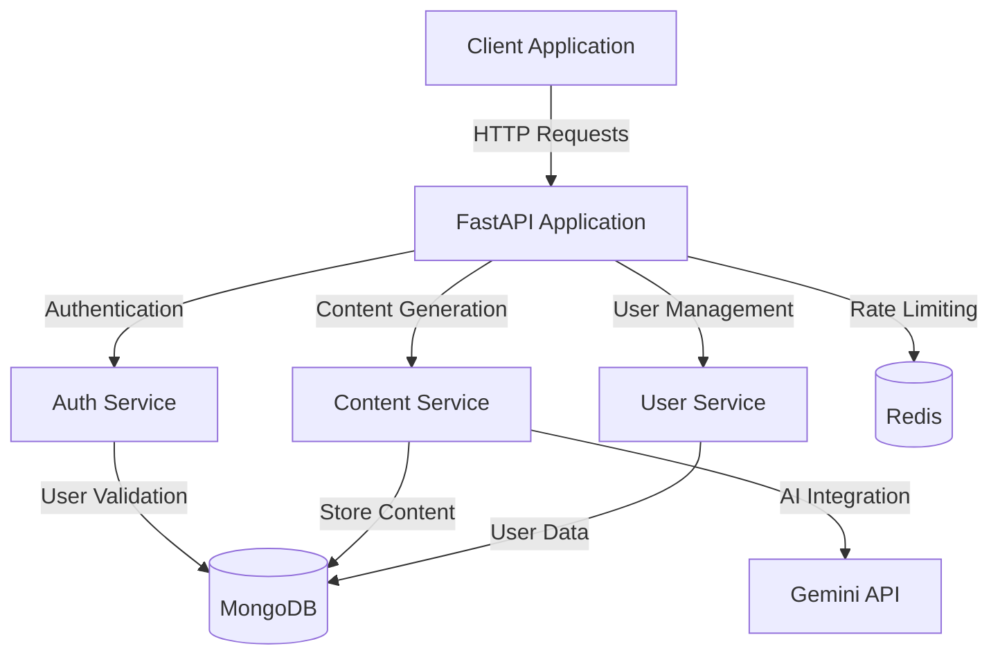
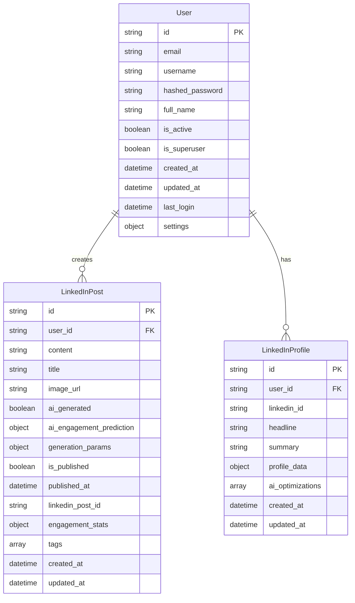

# Project Progress: SuperApp Backend

## 2023-07-10: Switching from Node.js to Python/FastAPI

### Rationale
We decided to switch from Node.js/Express to Python/FastAPI for the following reasons:
1. Better ecosystem for AI/ML integration
2. Type safety with Pydantic
3. Async support with performance benefits
4. Cleaner API organization with dependency injection
5. More developer-friendly documentation

### Changes Made
- Created FastAPI project structure
- Implemented Gemini AI service integration
- Set up MongoDB with Beanie ODM
- Implemented JWT authentication
- Created LinkedIn content generation endpoints

## LinkedIn Content Generation Service Implementation

### Overview
We've implemented the LinkedIn content generation service using Google's Gemini API. This service offers:

1. **Content Generation**: AI-powered generation of LinkedIn posts based on topics and parameters
2. **Content Analysis**: SEO and engagement analysis for existing content
3. **Profile Optimization**: Recommendations for improving LinkedIn profiles

### Technical Details
- Implemented `GeminiService` class with retry logic for API calls
- Created MongoDB models for `User`, `LinkedInPost`, and `LinkedInProfile`
- Set up FastAPI endpoints with proper validation using Pydantic
- Implemented secure authentication with JWT tokens

### API Endpoints
The following endpoints are now available:

1. **Authentication**
   - `/api/v1/auth/register`: User registration
   - `/api/v1/auth/login`: User login (returns JWT tokens)
   - `/api/v1/auth/refresh`: Refresh access token

2. **LinkedIn Content**
   - `/api/v1/content/linkedin/post/generate`: Generate LinkedIn post variations
   - `/api/v1/content/linkedin/post/analyze`: Analyze LinkedIn post for SEO and engagement
   - `/api/v1/content/linkedin/profile/optimize`: Optimize LinkedIn profile
   - `/api/v1/content/linkedin/posts`: Get user's LinkedIn posts

### Next Steps
1. Implement frontend components for content creation
2. Add LinkedIn API integration for direct posting
3. Implement content calendar and scheduling
4. Add analytics dashboard for content performance
5. Create user settings management

## Architecture

## Database Schema

