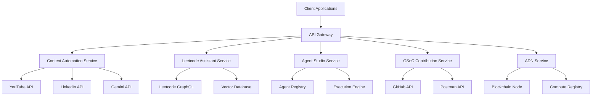

# 🚀 AI-Powered Ecosystem

Welcome to our integrated AI-powered ecosystem project! This repository contains the code and documentation for our comprehensive platform that combines content automation, learning assistance, AI agent creation, and decentralized computing.

> 🧭 **New here?** Start with our [Navigation Guide](Documentation/Navigation.md) to easily find your way around.
> 
> 📚 **Looking for docs?** Check our [Documentation Index](docs/index.md) for quick access to all project documentation.

## 🌟 Overview

Our ecosystem consists of several integrated components:

- **Content Automation**: Transform YouTube videos into engaging LinkedIn posts with guided AI modes (expert, intermediate levels)
- **AI Leetcode Assistant**: Personalized learning paths with compensation insights and interview preparation
- **AI Agent Studio**: Create and deploy AI agents with a progression from coding to no-code interfaces
- **GSoC Contributions**: Open-source AI tools, benchmarking, and SDK development for Gemini APIs
- **ADN (AI Democracy Network)**: Decentralized compute-sharing with Web3 incentives

## 📋 Project Status

| Component | Status | Next Milestone |
|-----------|--------|----------------|
| Project Setup | 🟡 In Progress | Complete documentation framework |
| Content Automation | 🟢 Research | YouTube API research and MVP design |
| Leetcode Assistant | 🟢 Research | GraphQL API exploration |
| AI Agent Studio | 🟢 Research | OpenAPI integration strategies |
| GSoC Contributions | 🟠 Planning | DeepMind project analysis and Postman collection development |
| ADN | 🟠 Planning | Whitepaper development and blockchain evaluation |

## 🚀 Getting Started

### Prerequisites

- Python 3.9+
- Node.js 16+
- Docker
- Git
- Poetry (Python dependency management)
- npm or yarn (JavaScript dependency management)

### Installation

1. Clone the repository:
   ```bash
   git clone https://github.com/your-organization/ai-ecosystem.git
   cd ai-ecosystem
   ```

2. Set up the backend environment:
   ```bash
   cd backend
   poetry install
   poetry shell
   python manage.py setup_development
   ```

3. Set up the frontend environment:
   ```bash
   cd frontend
   npm install
   npm run dev
   ```

4. Configure your environment variables:
   ```bash
   cp .env.example .env
   # Edit .env with your API keys and configuration
   ```

For detailed setup instructions, see our [Getting Started Guide](Documentation/Teaching/GettingStartedGuide.md).

## 📚 Documentation

Our documentation is organized into several categories:

- **[MasterPlan.md](MasterPlan.md)**: The comprehensive overview of our project
- **[Documentation/Progress](Documentation/Progress)**: Detailed logs of our development journey
- **[Documentation/NextSteps](Documentation/NextSteps)**: Current and upcoming tasks
- **[Documentation/Technical](Documentation/Technical)**: Component-specific technical specifications
- **[Documentation/Teaching](Documentation/Teaching)**: User-friendly guides and tutorials
- **[Documentation/Research](Documentation/Research)**: Central index of all research activities
- **[Documentation/Navigation.md](Documentation/Navigation.md)**: Guide to finding documentation

## 🏗️ Architecture

Our ecosystem follows a modular microservices architecture where each component can work independently but also integrate seamlessly with others.



## 👥 Contributing

We welcome contributions to all aspects of the project! Please see our [Contribution Guidelines](CONTRIBUTING.md) for details on how to get involved.

### Getting Started with Contributions

1. Pick an issue labeled `good first issue`
2. Fork the repository
3. Create a branch for your feature or bugfix
4. Submit a pull request

## 📅 Roadmap

### Phase 1: Foundation (Months 1-2)
- Core infrastructure setup
- Content Automation and Leetcode Assistant MVPs
- Initial documentation and research frameworks
- GSoC contribution planning

### Phase 2: Expansion (Months 3-4)
- AI Agent Studio prototype
- GSoC contribution implementation
- Advanced features for initial products
- ADN whitepaper completion

### Phase 3: Innovation (Months 5-6)
- ADN concept implementation
- No-code capabilities for AI Agent Studio
- Marketplace launch
- Integrated ecosystem experience

## 📄 License

This project is licensed under the MIT License - see the [LICENSE](LICENSE) file for details.

## 🙏 Acknowledgments

- The open-source community for inspiration and tools
- Google DeepMind for GSoC opportunities
- All contributors and team members

---

**Current Version**: 0.1.0 (Alpha)  
**Last Updated**: 2023-06-17 