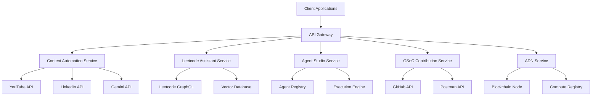

# 🚀 Getting Started with Our AI-Powered Ecosystem

Welcome to our comprehensive guide for getting started with our AI-powered ecosystem! This guide is designed to help new developers understand our platform, set up their development environment, and start contributing.

## 📋 What We're Building

We're building an integrated AI-powered ecosystem with several key components:

1. **Content Automation**: Automatically transform YouTube videos into engaging LinkedIn posts
2. **AI Leetcode Assistant**: Get guided learning paths and intelligent problem-solving assistance
3. **AI Agent Studio**: Create custom AI agents without coding skills
4. **GSoC Contributions**: Contribute to open-source projects with our Postman collection and Gemini API integration
5. **ADN Concept**: Participate in our decentralized compute sharing network with Web3 incentives

## 🛠️ Setting Up Your Development Environment

### Prerequisites

Before you begin, make sure you have the following installed:

- **Python 3.9+**: Our backend services run on Python
- **Node.js 16+**: Required for frontend development
- **Docker**: For containerized development and testing
- **Git**: For version control
- **Poetry**: For Python dependency management
- **npm or yarn**: For JavaScript dependency management

### Step 1: Clone the Repository

```bash
git clone https://github.com/your-organization/ai-ecosystem.git
cd ai-ecosystem
```

### Step 2: Set Up Backend Environment

```bash
cd backend
poetry install
poetry shell
python manage.py setup_development
```

### Step 3: Set Up Frontend Environment

```bash
cd frontend
npm install
npm run dev
```

### Step 4: Set Up API Keys

Copy the sample environment file and add your API keys:

```bash
cp .env.example .env
```

Edit the `.env` file to include your:
- YouTube API Key
- LinkedIn API Credentials
- Gemini API Key
- Database connection details

## 🧩 Understanding the Architecture

Our ecosystem follows a modular microservices architecture where each component can work independently but also integrate seamlessly with others.



## 🔍 Key Concepts

### Content Automation

The content automation pipeline works by:
1. Extracting video metadata from YouTube
2. Generating summaries using AI
3. Creating engaging LinkedIn posts
4. Publishing and tracking engagement

### AI Leetcode Assistant

Our Leetcode assistant helps developers by:
1. Recommending problems based on skill level
2. Providing hints and guidance
3. Explaining solutions with step-by-step reasoning
4. Tracking progress and suggesting improvements

### AI Agent Studio

Create custom AI agents by:
1. Defining agent objectives
2. Configuring knowledge sources
3. Setting interaction patterns
4. Deploying to our marketplace

### ADN (AI Decentralized Network)

Participate in our compute-sharing network:
1. Share idle computing resources
2. Earn tokens for contribution
3. Use tokens to run intensive AI tasks
4. Join the governance of the network

## 👩‍💻 Making Your First Contribution

We follow the standard GitHub flow for contributions:

1. **Fork the repository**: Create your personal fork
2. **Create a branch**: Make your changes in a new branch
3. **Submit a PR**: Open a pull request with a clear description
4. **Code Review**: Address feedback from maintainers
5. **Merge**: Once approved, your changes will be merged

### Contribution Guidelines

- Follow our code style (enforced by linters)
- Write tests for new features
- Update documentation to reflect your changes
- Keep PRs focused on a single change
- Reference issues in commit messages

## 🧪 Testing Your Code

Run the test suite before submitting your changes:

```bash
# Backend tests
cd backend
pytest

# Frontend tests
cd frontend
npm run test
```

## 📚 Additional Resources

- [Complete API Documentation](./api-docs.md)
- [Architecture Deep Dive](./architecture.md)
- [Component Specifications](./components.md)
- [Common Issues & Solutions](./troubleshooting.md)
- [Performance Optimization Guide](./performance.md)

## 🆘 Getting Help

- **Discord Community**: Join our [Discord server](https://discord.gg/example)
- **GitHub Issues**: Report bugs or suggest features
- **Weekly Office Hours**: Join our open development calls every Friday
- **Documentation**: Explore our comprehensive wiki

## 🎯 Next Steps

After setting up your environment, try these tasks to get familiar with the codebase:

1. **Run all components locally**: Make sure everything works
2. **Complete a tutorial**: Follow one of our step-by-step guides
3. **Fix a beginner-friendly issue**: Look for "good first issue" tags
4. **Join a team meeting**: Introduce yourself to the community

We're excited to have you on board! If you have any questions, please don't hesitate to reach out to the core team. 