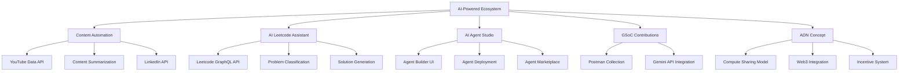

# 🚀 AI-Powered Ecosystem: Master Project Plan

## 📋 Project Overview

This document outlines our comprehensive plan for building an integrated AI-powered ecosystem focused on:

1. **Content Automation** - YouTube to LinkedIn pipeline
2. **AI Leetcode Assistant** - Guided learning paths and problem-solving frameworks
3. **AI Agent Studio** - No-code AI agent builder
4. **GSoC Contributions** - Postman collection and Gemini API integration
5. **ADN Concept** - Decentralized compute sharing network with Web3 incentives

## 🏗️ Project Architecture



## 📁 Project Structure

To effectively manage this project and handle memory limitations:

```
.
├── Documentation/
│   ├── Progress/              # Detailed progress logs
│   ├── NextSteps/             # Actionable items
│   ├── Technical/             # Technical documentation
│   └── Teaching/              # User-friendly guides
├── ContentAutomation/
│   ├── YouTube/               # YouTube data extraction
│   ├── Summarization/         # Content processing 
│   └── LinkedInPoster/        # LinkedIn integration
├── LeetcodeAssistant/
│   ├── API/                   # Leetcode integration
│   ├── ProblemSolver/         # Solution generation
│   └── LearningPaths/         # Guided learning
├── AgentStudio/
│   ├── Frontend/              # UI/UX for agent builder
│   ├── Backend/               # Agent logic and deployment
│   └── Marketplace/           # Agent sharing platform
├── GSoCContributions/
│   ├── PostmanCollection/     # API documentation
│   └── GeminiIntegration/     # Gemini API implementation
└── ADN/
    ├── ComputeSharing/        # Distributed compute model
    ├── Blockchain/            # Web3 integration
    └── IncentiveSystem/       # Reward mechanisms
```

## 💼 AiCtoPersona (CTO Persona)

Our development approach follows this persona:

- **Friendly, supportive, clear, structured**
- **Focus**: 70% conceptual understanding, 30% technical options
- **Encourage**: Documentation, planning, frequent progress reviews
- **Communication**: Maintain simplicity, avoid unnecessary jargon

## ✅ Current Progress

### Content Automation
- ✅ Defined YouTube to LinkedIn pipeline architecture
- ✅ Researched YouTube Data API access methods
- ✅ Identified potential summarization approaches

### AI Leetcode Assistant
- ✅ Defined guided learning paths concept
- ✅ Created problem-solving frameworks outline
- ✅ Researched Leetcode problem structure

### AI Agent Studio
- ✅ Conceptualized no-code AI agent builder
- ✅ Defined high-level architecture

### GSoC Contributions
- ✅ Established Postman collection format
- ✅ Integrated Gemini API for basic functionality

### ADN Concept
- ✅ Defined decentralized compute sharing network
- ✅ Outlined Web3 incentive structure

## 🔲 Next Steps

### Research Tasks
- 🔲 Content summarization tools comparison
- 🔲 Gemini API subtitle extraction capabilities
- 🔲 Leetcode GraphQL API schema analysis
- 🔲 RAG (Retrieval Augmented Generation) implementation for code solutions
- 🔲 GSoC project documentation standards
- 🔲 Postman collection best practices
- 🔲 Web3 integration options for compute sharing

### Development Tasks
- 🔲 Build Content Automation MVP
  - 🔲 YouTube data extraction component
  - 🔲 Content summarization engine
  - 🔲 LinkedIn posting mechanism
- 🔲 Build AI Leetcode Assistant MVP
  - 🔲 Problem retrieval system
  - 🔲 Solution generation with explanations
  - 🔲 Learning path progression tracking
- 🔲 Start AI Agent Studio prototyping
  - 🔲 UI/UX wireframes
  - 🔲 Basic agent configuration options
- 🔲 Prototype ADN compute-sharing model
  - 🔲 Resource allocation mechanism
  - 🔲 Basic blockchain integration

### Documentation Tasks
- 🔲 Update Masterplan.md with sprints and milestones
- 🔲 Create PRD/BRD for each product component
- 🔲 Develop technical documentation for APIs and integrations
- 🔲 Create user guides for each component

## 🛠️ Technical Stack

### Backend
- **Primary**: Python with FastAPI
- **Services**: RESTful APIs, GraphQL endpoints
- **Processing**: Asynchronous task handling

### Frontend
- **Framework**: Next.js (SSR, SEO friendly)
- **UI**: React with Tailwind CSS
- **State Management**: Redux or Context API

### AI Technologies
- **LLM**: Gemini API, Ollama
- **Local Models**: Deployment and fine-tuning options
- **Embeddings**: Text and code vectorization

### Database
- **Relational**: PostgreSQL
- **Vector Storage**: Weaviate or Pinecone
- **Caching**: Redis

### Task Management
- **Queue**: Celery
- **Message Broker**: Redis
- **Scheduling**: Cron jobs or Celery Beat

### Web3 (for ADN)
- **Blockchain**: Ethereum/Polygon
- **Smart Contracts**: Solidity
- **Wallet Integration**: Web3.js or ethers.js

### DevOps
- **Containerization**: Docker
- **CI/CD**: GitHub Actions
- **Monitoring**: Prometheus, Grafana

## 📚 Educational Documentation

We will maintain comprehensive educational materials:

### User Guides
- How to use each product component
- Step-by-step tutorials with screenshots
- Video demonstrations for complex features

### Developer Documentation
- API documentation with examples
- Integration guides
- Local development setup instructions

### AI Understanding
- Explanations of AI capabilities and limitations
- Best practices for prompt engineering
- Guidance on fine-tuning and customization

## 🔄 Project Management

### Sprint Structure
- 2-week sprints with clearly defined goals
- Regular sprint planning, review, and retrospective
- Kanban board for task tracking

### Documentation Rhythm
- Weekly progress updates
- Bi-weekly technical documentation revisions
- Monthly comprehensive project review

### Testing Strategy
- Unit tests for core functionality
- Integration tests for API endpoints
- End-to-end tests for critical user journeys
- Performance testing for compute-intensive operations

## 🔑 Success Metrics

- **Content Automation**: Successful post generation rate, engagement metrics
- **Leetcode Assistant**: Problem-solving success rate, user learning progress
- **Agent Studio**: Number of agents created, marketplace activity
- **GSoC**: Contribution acceptance rate, community feedback
- **ADN**: Compute sharing efficiency, token economics health

## 🛡️ Risk Management

| Risk | Impact | Likelihood | Mitigation |
|------|--------|------------|------------|
| LLM API cost escalation | High | Medium | Implement caching, throttling, and usage monitoring |
| Web3 regulatory challenges | High | Medium | Research compliance requirements, consult legal experts |
| Leetcode API limitations | Medium | High | Design fallback scraping mechanism, cache problem data |
| AI performance inconsistency | Medium | Medium | Implement quality checks, human-in-the-loop validation |
| Technical debt accumulation | Medium | High | Regular refactoring, consistent code reviews |

## 📆 Timeline

### Phase 1: Foundation (Months 1-2)
- Core infrastructure setup
- MVPs for Content Automation and Leetcode Assistant
- Initial documentation framework

### Phase 2: Expansion (Months 3-4)
- AI Agent Studio prototype
- GSoC contribution enhancements
- Advanced features for initial products

### Phase 3: Innovation (Months 5-6)
- ADN concept implementation
- Marketplace launch
- Integrated ecosystem experience

## 🔄 Continuous Improvement

- Regular user feedback collection
- Performance monitoring and optimization
- Quarterly strategic reviews
- Technology stack reassessment 