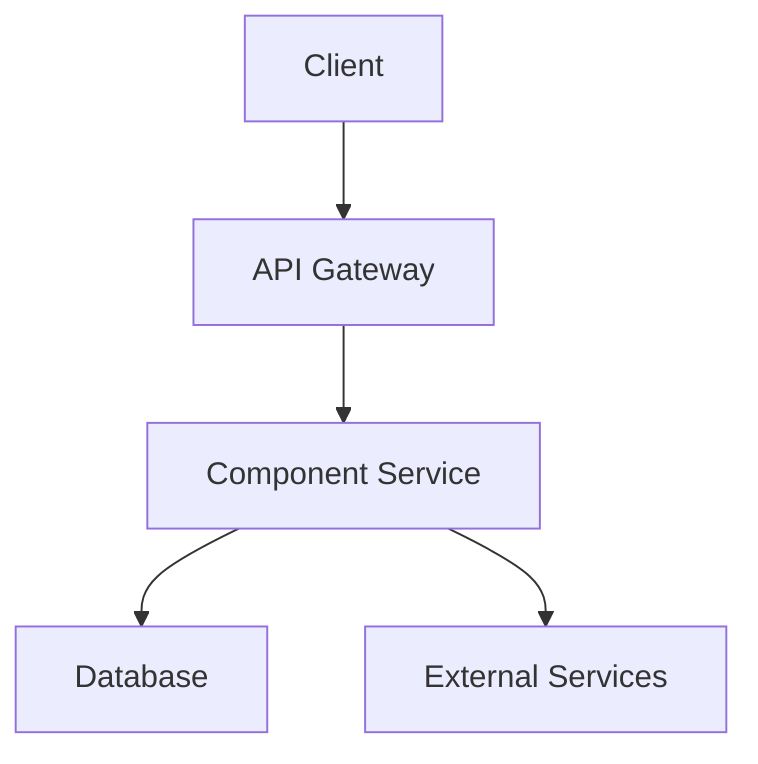

# Technical Specification: [Component Name]

## Overview

[Provide a brief description of the component/feature and its purpose within the overall ecosystem]

## Architecture



[Replace with the appropriate architecture diagram for your component]

## Key Components

### [Component 1]
- **Purpose**: [Brief description of what this component does]
- **Responsibilities**: 
  - [List key responsibilities]
  - [...]
- **Interfaces**: [Describe the inputs and outputs of this component]

### [Component 2]
- **Purpose**: [Brief description of what this component does]
- **Responsibilities**: 
  - [List key responsibilities]
  - [...]
- **Interfaces**: [Describe the inputs and outputs of this component]

## Data Model

### [Entity 1]
| Field | Type | Description | Constraints |
|-------|------|-------------|-------------|
| id | UUID | Unique identifier | Primary key |
| name | String | Name of the entity | Not null |
| ... | ... | ... | ... |

### [Entity 2]
| Field | Type | Description | Constraints |
|-------|------|-------------|-------------|
| id | UUID | Unique identifier | Primary key |
| entity1_id | UUID | Reference to Entity 1 | Foreign key |
| ... | ... | ... | ... |

## API Endpoints

### [Endpoint 1]
- **URL**: `/api/v1/[path]`
- **Method**: `GET`
- **Query Parameters**:
  - `param1`: [Description] (optional/required)
  - `param2`: [Description] (optional/required)
- **Request Body**: None
- **Response**:
  ```json
  {
    "field1": "value1",
    "field2": "value2"
  }
  ```
- **Error Responses**:
  - `400 Bad Request`: [Description of when this occurs]
  - `404 Not Found`: [Description of when this occurs]
  - `500 Internal Server Error`: [Description of when this occurs]

### [Endpoint 2]
- **URL**: `/api/v1/[path]`
- **Method**: `POST`
- **Request Body**:
  ```json
  {
    "field1": "value1",
    "field2": "value2"
  }
  ```
- **Response**:
  ```json
  {
    "id": "uuid",
    "field1": "value1",
    "field2": "value2",
    "createdAt": "timestamp"
  }
  ```
- **Error Responses**:
  - `400 Bad Request`: [Description of when this occurs]
  - `401 Unauthorized`: [Description of when this occurs]
  - `500 Internal Server Error`: [Description of when this occurs]

## External Dependencies

| Dependency | Version | Purpose | API Documentation |
|------------|---------|---------|-------------------|
| [Dependency 1] | X.Y.Z | [What it's used for] | [Link to docs] |
| [Dependency 2] | X.Y.Z | [What it's used for] | [Link to docs] |

## Security Considerations

- **Authentication**: [Describe authentication approach]
- **Authorization**: [Describe authorization model]
- **Data Protection**: [Describe how sensitive data is protected]
- **Rate Limiting**: [Describe rate limiting strategy]
- **Input Validation**: [Describe input validation approach]

## Performance Considerations

- **Expected Load**: [Describe expected load characteristics]
- **Caching Strategy**: [Describe caching approach]
- **Scalability Plan**: [Describe how this component can scale]
- **Resource Requirements**: [Describe CPU, memory, storage requirements]

## Monitoring and Logging

- **Key Metrics**:
  - [Metric 1]: [Description and thresholds]
  - [Metric 2]: [Description and thresholds]
- **Log Strategy**:
  - [Log level policy]
  - [Structured logging format]
  - [Critical events to log]

## Testing Strategy

### Unit Tests
- [Describe key unit test areas and approach]

### Integration Tests
- [Describe key integration test scenarios]

### Performance Tests
- [Describe performance testing approach]

## Deployment Considerations

- **Environment Requirements**: [Describe specific environment needs]
- **Configuration Management**: [Describe configuration approach]
- **Deployment Process**: [Describe deployment steps]
- **Rollback Procedure**: [Describe rollback approach]

## Future Enhancements

- [List potential future improvements]
- [Note any technical debt to be addressed later]

## Open Questions

- [List any unresolved technical questions]
- [Note areas requiring further research]

---

## Document History

| Version | Date | Author | Description of Changes |
|---------|------|--------|------------------------|
| 0.1 | YYYY-MM-DD | [Author Name] | Initial draft |
| ... | ... | ... | ... | 